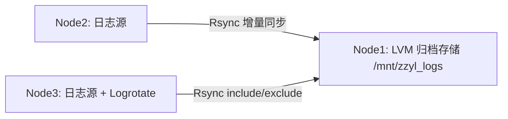

# zzyl-log-archive


## 项目简介 (Introduction)

- **情境 (Situation)**：多节点 Nginx 日志分散在不同机器，容量不可控，手工备份易遗漏、易拖慢业务。
- **任务 (Task)**：建立一套可复现、可审计、可扩展的集中式日志归档与同步系统，降低存储与运维成本。
- **行动 (Action)**：在 Node1 通过 LVM（逻辑卷管理）构建弹性存储；Node3 使用 Logrotate（日誌轮转）做按日压缩与保留策略；Rsync 结合 include/exclude 只同步“昨天及以前”的日志；Crontab 配合 Flock（文件锁）防重入；一键脚本 collect.sh 保证环境快速复刻。
- **结果 (Result)**：在不增加复杂度的前提下实现稳定归档、可预测容量增长、可控带宽消耗，降低人工操作与故障风险。

## 架构图 (Architecture)



## 核心特性 (Key Features)

- **LVM 弹性扩容**：通过逻辑卷动态扩容存储池，降低容量焦虑，避免频繁迁移与停机窗口。
- **Flock 互斥锁**：定时任务加锁防重入，避免并发写入导致的归档一致性问题与磁盘抖动。
- **Logrotate 策略**：按日轮转 + 压缩 + 保留 6 份，建立清晰的日志生命周期（生命周期管理）边界。
- **Rsync 增量同步与去重**：只同步“昨天及以前”的日志，减少重复传输、节省带宽，并降低存储成本。

## 快速开始 (Quick Start)

> 目标：复现完整的日志治理与归档链路。

1. 在 Node1/Node3 准备环境并配置 SSH 免密。
2. 运行一键采集脚本（推荐）：
   ```bash
   bash tools/collect.sh
   ```
3. 检查验证脚本：
   ```bash
   bash tools/verify.sh
   ```

## 技术栈 (Tech Stack)

- Linux（CentOS）
- Bash/Shell
- Systemd / Cron（定时任务）
- LVM（逻辑卷管理）
- SSH + Rsync

## 目录结构 (Structure)

```
.
├── node1/        # LVM 与归档存储侧
├── node3/        # 日志源与 logrotate 配置
├── tools/        # 采集与验证脚本
└── README.md
```

## 价值说明 (Why it matters)

- **省钱**：增量同步 + 去重减少带宽与存储浪费。
- **提效**：一键化采集降低人工部署成本。
- **避坑**：Flock 防重入避免任务重叠造成的数据不一致与磁盘抖动。

